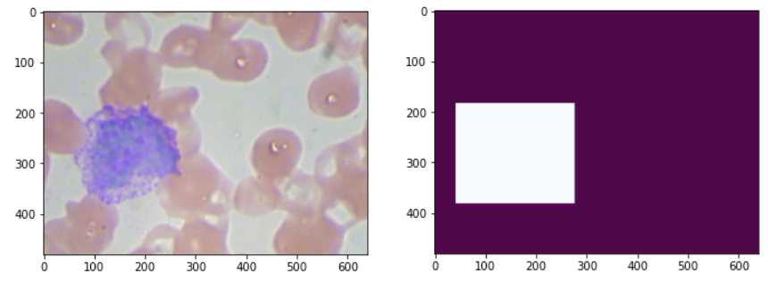

# Genetic Algortihm
Autor: Luis Cossio

Implementation of genetic a genetic algorithm (GA) to create filters capable of withe blood cells (WBC's) detection in images

## Description
- Use of [BCCD](https://www.kaggle.com/surajiiitm/bccd-dataset) dataset. 
- Use of the source code attached. 
- The dataset and the source code of the Kaggle dataset needs to be downloaded separately from this repository following the structure given in the Structure section. 


## Recognition
Thanks to the publisher surajmishra for the submission of the dataset and source code to Kaggle. BCCD Dataset is under MIT licence.


## Structure
The structure of the project:
  ```
  GA_WBC_detection
  ├── BCCD_Dataset-master
  │   └── ... #BCCD dataset
  ├── resources images # Figures of the results
  │   └── image_and_mask.png  
  ├── config.py         # config file
  ├── data_manager.py   # data manager files 
  ├── LICENSE
  └── README.md
  ```


## Description of Algorithm
*   Training and fitting calculation is done by feeding the GA with samples of the image and expected ground truth:

  
*   A sample is consider as an image of blood cells from the BCCD dataset and the corresponding mask where there is a bounding box marking where there is a white blood cell. 
  

*   The Genetic algorithm attempts to found a series of filters that can replicate the ground truth of the samples. 

*   A filter consist of a tensor of shape ``[row_kernel,col_kernel,channels_in,channels_out]``. An individual in this context consist of N filters, that defines N convolutional layers.  

*   The filters operates over a batch of input images in a Convolutional neural network (CNN) like manner, where each filter defines a layer. A convolution layer consist of the next operations:
    
    1- Convolution 2D between tensor and filter 
    
    2- Activation Function (Relu for all layers but the last one)
    
    3- Pooling 
    
    4- Pseudo Normalization
    
*   The last Layer uses a sigmoid function to model and output mask defined between [0,1]. Said result is then re-scaled so the maximum value of the output mask is 1.0. This is done because some output masks achieved a max value below 1.0, for example 0.74, but given that said value is the maximum in all the mask it's locigal to take as 1.0, and scale all of the rest result accordingly.    
     
*   Score is the calculated as the -(cross-entropy) of the mask output, with the predicted mask.  
    
## Results 

## Libraries
numpys matplotlib scipy scikit learn


## Installation
## Setting up BCCD repository


### Install python
In order to install the programing language follow the installation instructions in the official site:

https://www.python.org/downloads/ 

### Install Pip
In case of not having an installation tool, it is recommended install pip, following the instruccions of the official site:

https://pip.pypa.io/en/stable/reference/pip_install/

### Install libraries
To install the libraries just run the next code in the commando line using pip:
```
pip install -r requirements.txt
```


## Deployment
To use the neural network just run the python program with the following command, referencing this folder:
```
python .py 
```
This loads the dataset, split it and normalize it. Then trains the network, show the confusion and matrix and plot the error, 


## Info
Language: Python
 
Version: python 3.7